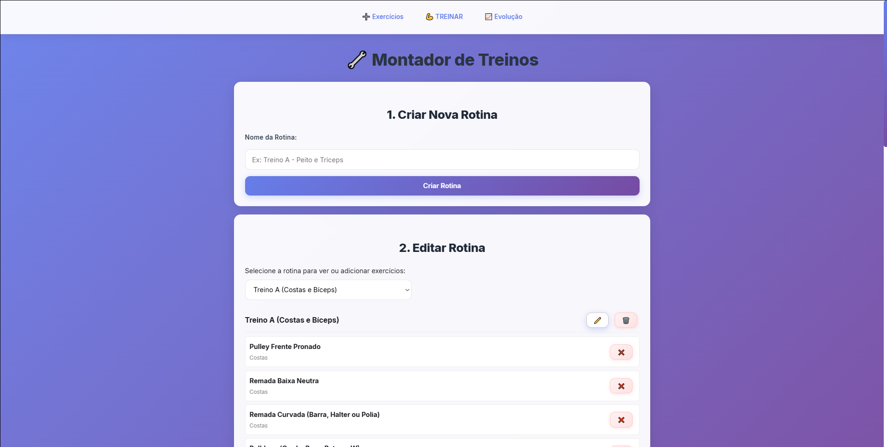
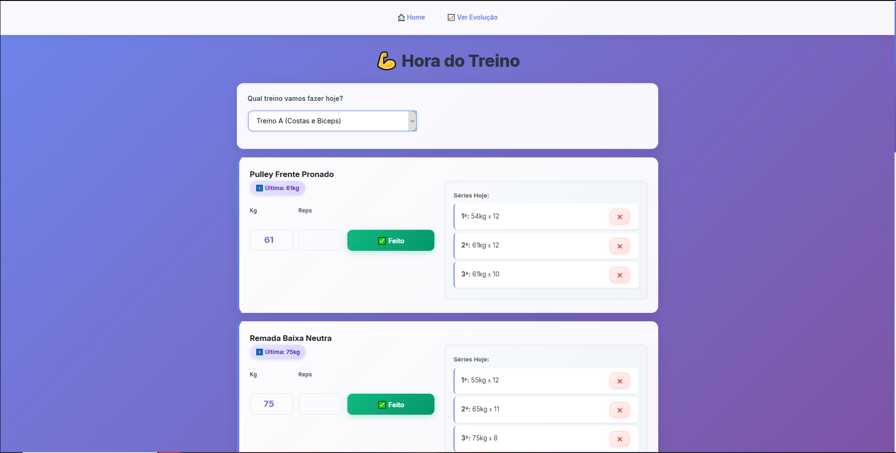
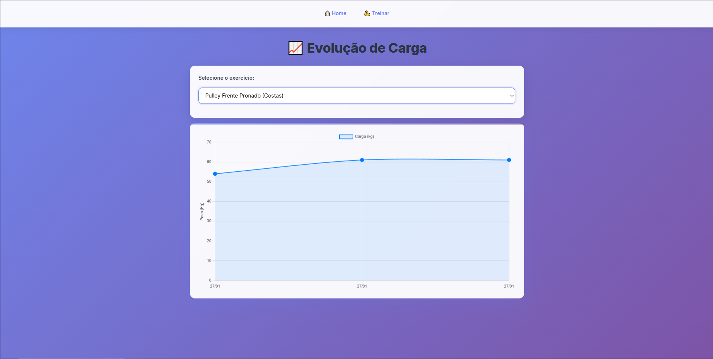
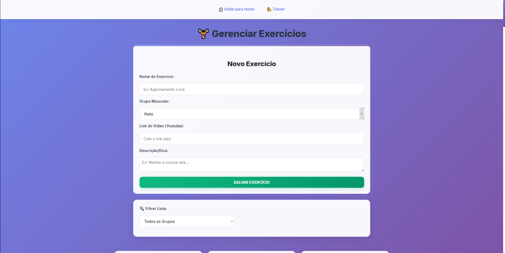
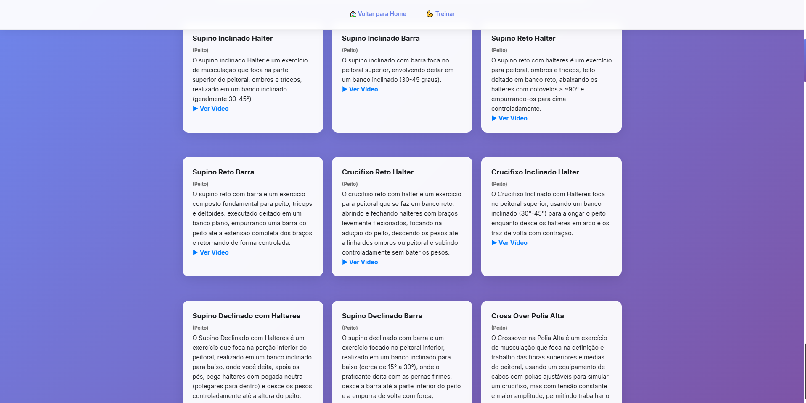
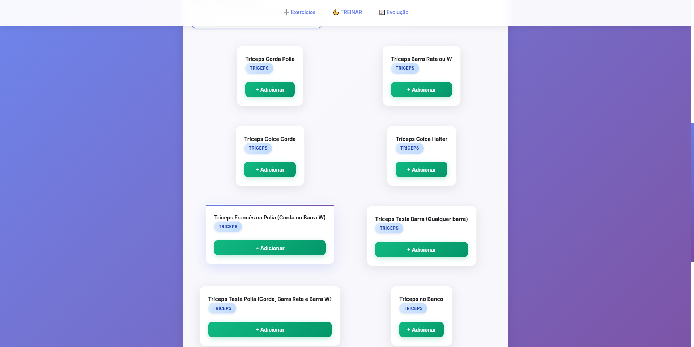

# 🏋️ MyWorkout - Gerenciador de Treinos e Progressão

O **MyWorkout** é uma aplicação Fullstack desenvolvida para facilitar anotar cargas, ver exercícios com links pra vídeos demonstrando como fazer e ver progressão de carga em cada exercício. O sistema permite gerenciar exercícios, montar rotinas personalizadas, registrar cargas em tempo real e visualizar a evolução através de gráficos interativos.

Projetado para ser utilizado via **Rede Wi-Fi Local**, permitindo o controle pelo celular enquanto o servidor roda no computador.

---

## 📸 Demonstração

  
  
  
  
  
  

## 🚀 Funcionalidades

- **📚 Banco de Exercícios:** Cadastro completo com nome, grupo muscular e link para vídeo demonstrativo (YouTube).
- **📝 Montagem de Rotinas:** Criação de fichas personalizadas (Ex: Treino A, B, C) adicionando exercícios do banco.
- **💪 Modo Treino:** - Interface otimizada para celular.
    - Histórico automático: O sistema sugere a carga usada no treino anterior.
    - Cronologia do dia: Lista as séries já realizadas na sessão atual.
- **📈 Dashboard de Evolução:** Gráficos interativos (Chart.js) que mostram a progressão de carga de cada exercício ao longo do tempo.
- **📱 Design Responsivo:** Interface moderna, limpa e focada na usabilidade mobile (botões grandes, fácil navegação).

## 🛠️ Tecnologias Utilizadas

### Backend (API REST)
- **Java 17**
- **Spring Boot 3** (Web, Data JPA)
- **PostgreSQL** (ou MySQL)
- **Maven**

### Frontend
- **HTML5 & CSS3** (Flexbox, Grid Layout, Variáveis CSS)
- **JavaScript (Vanilla)** (Fetch API, DOM Manipulation)
- **Chart.js** (Visualização de Dados)

### Pré-requisitos
- Java 17+ instalado
- Maven instalado
- Banco de Dados (PostgreSQL ou MySQL) rodando

## 🔮 Próximos Passos
* [ ] Implementação de Login com Spring Security.
* [ ] Deploy da aplicação na nuvem.
---
Desenvolvido por **[Murilo da Silva Santos]** 🚀